# Завантажити Tailscale 
[https://tailscale.com/download](https://tailscale.com/download) 

Для макОС — [https://pkgs.tailscale.com/stable/Tailscale-latest-macos.pkg](https://pkgs.tailscale.com/stable/Tailscale-latest-macos.pkg) 
Для вінди – [https://pkgs.tailscale.com/stable/tailscale-setup-latest.exe](https://pkgs.tailscale.com/stable/tailscale-setup-latest.exe)   
**Для лінукса — curl -fsSL https://tailscale.com/install.sh | sh **  
  
  
**Залогінітись в аплікацію 
Логін через ГуглАкк 
Логін в гугл та в сервер вам має надати адміністратор **  
  
Підключити диск в файндер (медія або стройова)  
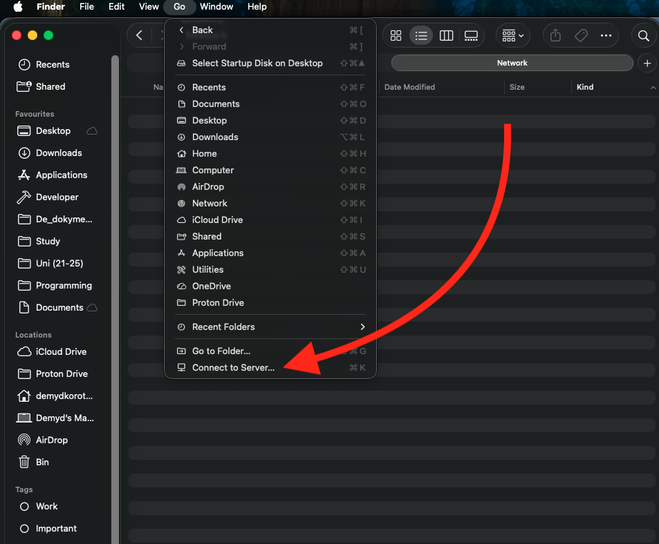  
Заходимо в Finder -> Go -> Connect to Sever… (або шорткат cmd+K)  
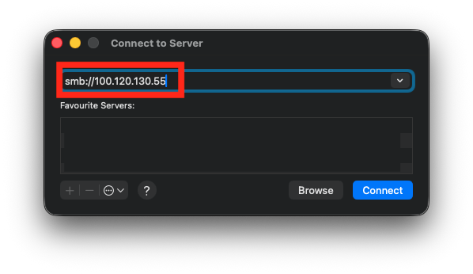  
Вводимо IP серверу з Tailscale — для віддаленого доступу   
[smb://100.120.130.55](smb://100.120.130.55)  
  
АБО  
  
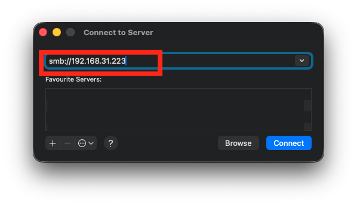  
Вводимо локальне IP — для доступу лише в межах WiFi офісу   
  
[smb://192.168.31.223](smb://192.168.31.223)  
  
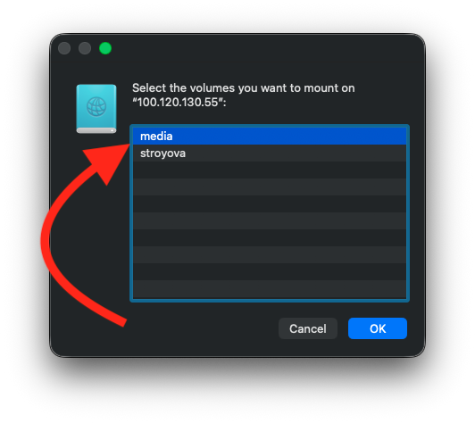  
Обираємо диск до якого потрібен доступ (у випадку якщо оберете не той — ваш обліковий запис не пустить вас, повернетесь на попередній крок)   
  
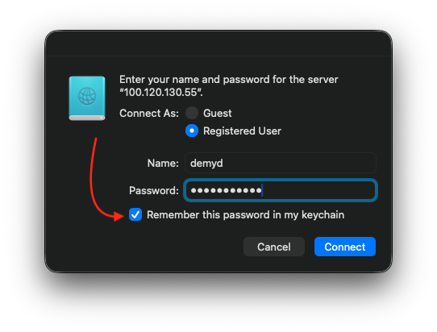  
Вводимо юзернейм+пароль та клікаємо запамʼятати цей пароль   
  
   
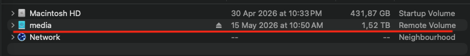  
Диск зʼявиться у вас в розділі з усіма томами   
  
Для подальшого автоматичного підʼєднання додайте цей диск та аплікацію Tailscale в обʼєкти логіну   
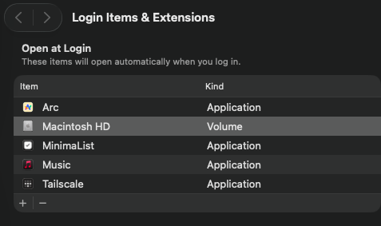  
  
Підключити диск в провідник (медія/стройова)  

В провіднику обрати розділ “Цей ПК”   
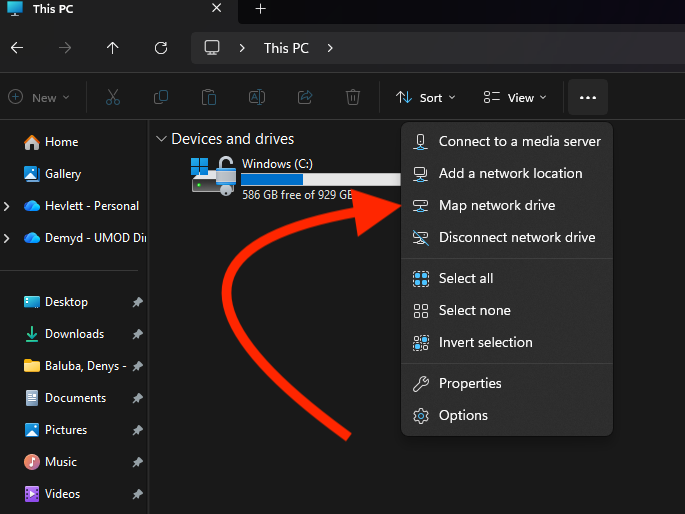  
Та обрати функцію “Map network drive”  
  
У наступному вікні обрати літеру для диску (по базовм налаштуванням це буде Z:)   
  
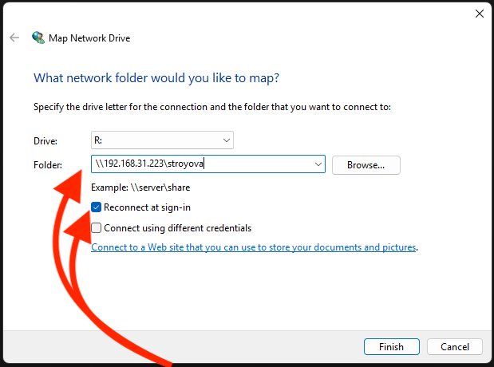  
Ввести 
\\192.168.31.223\stroyova   
для локального підʼєднання до диску стройової (доступ лише в межах WiFi офісу)   
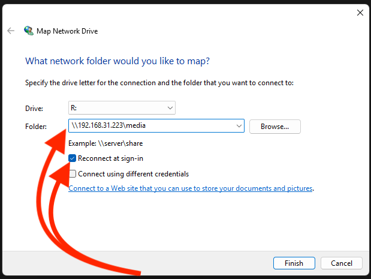  
Ввести 
\\192.168.31.223\media   
для локального підʼєднання до диску медійки (доступ лише в межах WiFi офісу)   
  
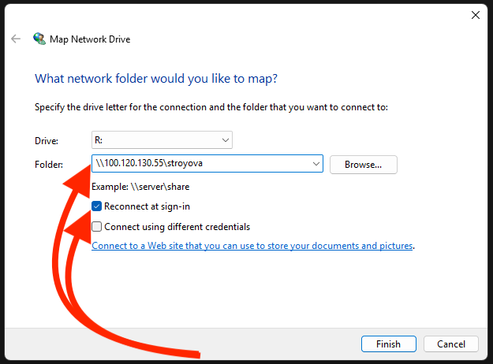  
Ввести 
\\100.120.130.55\stroyova   
для підʼєднання до диску стройової через Tailscale (доступ у будь-якій точці де є інтренет)   
  
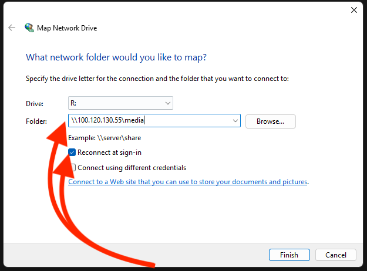  
Ввести 
\\100.120.130.55\media   
для підʼєднання до диску стройової через Tailscale (доступ у будь-якій точці де є інтренет)   
  
Автоматично буде стояти флажок “Reconnect at sign-in” — це не змінюйте, аби без зайвого клопоту підʼєднуватись після перезавантажень ПК  
  
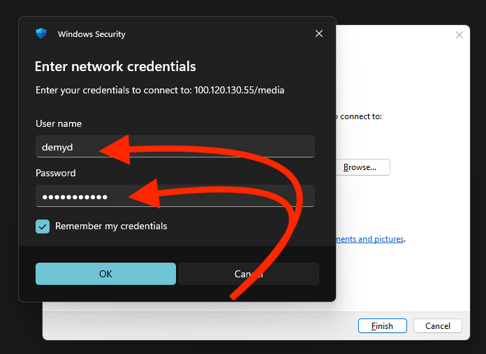  
Після цих налаштувань введіть свій юзернейм+пароль та поставте флажок “Remember my credentials”  
  
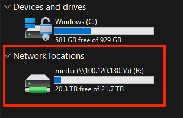  
  
Отак в розділі “”Цей ПК” буде виглядати ваш мережевий диск  
  
